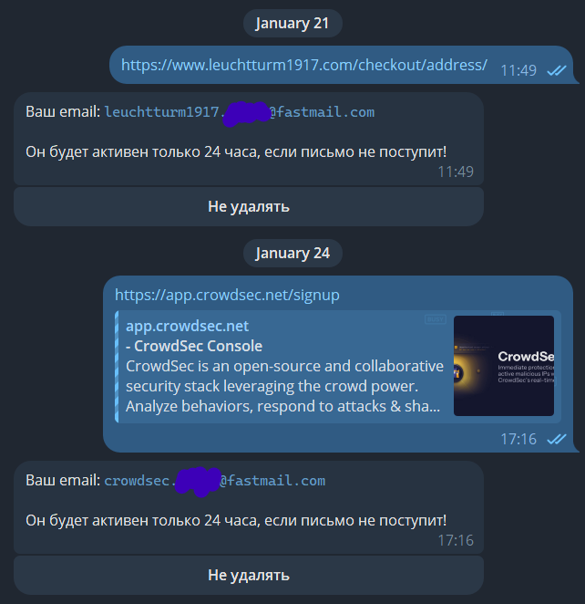

# Masked Email Bot

[](https://t.me/masked_email_bot)
[](https://krasovs.ky/masked-email-bot/terms.html)
[](https://krasovs.ky/masked-email-bot/privacy-policy.html)

Dead simple Telegram bot that allows you to create masked emails from any device with Telegram installed.

1) My hosted instance uses the official OAuth2 integration; this allows my app to be shown as the creator of
   masked emails in the web UI (it just looks nice).
2) You can paste a link and receive a masked email with a prefix. For example, pasting https://account.google.com
   will create something like google.cvbsd@fastmail.com. This URL will be shown in the web UI as the URL for
   which this email was created.
3) After creating it, it will be shown in your web UI only after receiving one email; otherwise, it will be
   removed after 24 hours. If you are sure you need that email anyway, just click "don't remove it."
4) You can send plain text, and it will also be used as a prefix.

## Screenshot



## Building

SQLite uses `modernc.org/sqlite`, so building a static binary does not require a C compiler:

```bash
CGO_ENABLED=0 go build -o masked-email-bot ./cmd/masked-email-bot
```

The Dockerfile also builds with CGO disabled.
